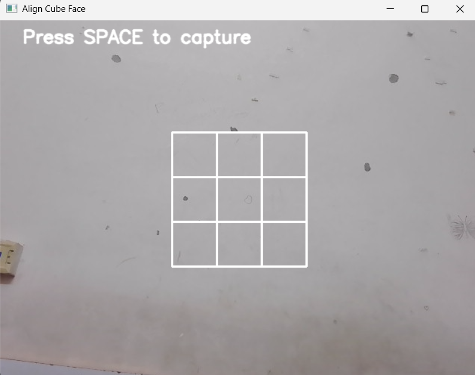
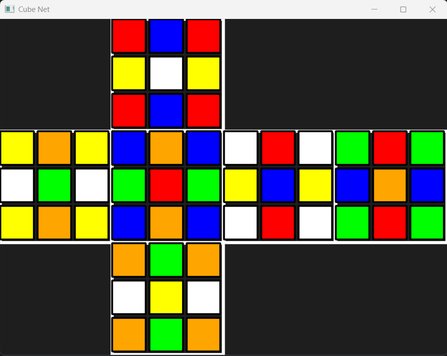
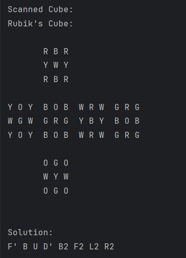
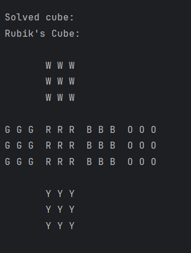

# "CUBIX" 🧊
# Rubik's Cube Solver 

A C++ project to scan, represent, and solve a Rubik’s Cube using multiple solver algorithms and efficient cube representations. This project includes a real-time camera scanner, various cube representations, and multiple solving strategies, including the IDA* solver using Korf’s Algorithm.

# 📚 Terminology

Cubie: One of the 26 mini-cubes of a Rubik’s Cube, can have 1, 2, or 3 colored sides.

Center Cubie: 6 center cubies, one per face, always fixed.

Edge Cubie: 12 cubies with two colored sides.

Corner Cubie: 8 cubies with three colored sides.

Face: A side of the cube with 9 cubies (1 center, 4 edges, 4 corners).

🔄 Operations and Notation

Clockwise rotation: F, R, U, B, L, D

Counter-clockwise (prime) rotation: F', R', U', B', L', D'

Double rotation: F2, R2, U2, B2, L2, D2

18 possible moves:

F, F’, F2, U, U’, U2, L, L’, L2, D, D’, D2, R, R’, R2, B, B’, B2

Reference: Ruwix Rubik’s Cube Notation

### 🖥 Cube Representations

3D Array Representation: cube[6][3][3] stores the colors of each face.

1D Array Representation: cube[54] sequentially stores all stickers for fast access.

Bitboard Representation: Each face is a 64-bit integer using 8-bit encoding per sticker.

These representations allow efficient rotation, comparison, and solver integration.

### 🧮 Solvers

Implemented algorithms to solve the cube:

DFS (Depth-First Search)

BFS (Breadth-First Search)

IDDFS (Iterative Deepening DFS)

IDA* (Iterative Deepening A*) using pattern databases

IDA* Solver – Korf’s Algorithm

IDA* combines A* and IDDFS, using pattern databases as a heuristic for optimal moves.

# 🖼 Cube Scanner Instructions

Start with White face up, then Green → Red → Blue → Orange → Yellow centers.

Press 'n' to capture the next face, 'r' to rescan the current face.

Ensure good lighting for accurate scanning.

# 🖼 Demo

### 1. Scanning the Cube

Example Scrambled Cube Screenshots:

### 2. Local Output

#### 🗂 Database & Pattern Files

Corner Pattern Database: Stores precomputed moves to speed up IDA* solver.

CornerDBMaker.cpp used to generate database files.

Database file example: Databases/cornerDepth5V1.txt

#### 💻 Build & Run

Clone repository:

git clone https://github.com/Mokshada30/rubiks_cube_solver.git

Build with CMake in CLion or terminal.

Run the program:

./rubiks_cube_solver

Follow scanner instructions to capture the cube, then watch the solution being printed.

## How IDA* Works:

A* Algorithm: Prioritizes nodes using:

f(n) = g(n) + h(n)

g(n): Distance from start to current node

h(n): Estimated distance from current node to goal

Heuristic: Provides an estimate of distance to the solved cube. Must underestimate or match, never overestimate.

Pattern Databases:

Corner Pattern Database: Stores minimal moves to solve corners, assuming edges are solved.

Edge Pattern Database: Stores moves to solve edges (optional; not implemented here).

This project uses only the Corner Pattern Database for simplicity and efficiency.

IDA* Algorithm:

Run A* with a maximum f(n) bound.

If exceeded, prune the branch and track minimum f(n) overbound as next_bound.

Repeat A* with next_bound until the goal state is reached.

# References:

Korf’s Research Paper:
https://www.cs.princeton.edu/courses/archive/fall06/cos402/papers/korfrubik.pdf

#### 👤 Author

Mokshada Mali – GitHub